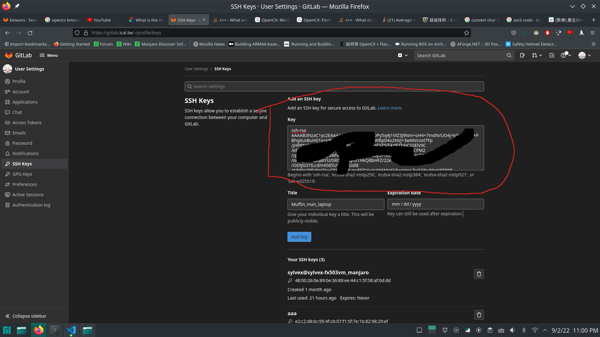

# K-means & C++ Tutorial & Opencv

Kmeans和c++的教學

這個教學是提供給擁有一定基礎程式語言的喵喵\
會嘗試把一點點的C++的特色帶進來，讓喵喵們對於實驗室過高的寫程式門檻有一點概念\
不至於說看到實驗室的程式碼覺得：喵的這個到底是在衝三小

## 第零章 如何設置git

如果不能git clone專案的話：
### 下載git

```
sudo apt-get install git
```

### 設置git ssh-keygen

```
ssh-keygen
```
一路enter就好 不要管什麼passphrase和路徑 (enter時會依據括號的預設值)\
然後：

```
cat ~/.ssh/id_rsa.pub
```
以顯示公鑰 要從ssh-rsa開始複製起 \
將下方出來的公鑰複製到gitlab -> 右上頭貼 ->左方SSH Keys -> Key大格子裡面 \
（終端機複製如果不會的話 請滑鼠框選並ctrl-shift-c) \
如下圖匡選所示：\

Title填能夠辨認你的電腦本體：如Tom_laptop_Asus \
Expiration Date先不要動

### 設置git config

```
git config --global user.name "你的學號"
git config --global user.email "你的學校信箱"
```
之後再試試看git clone

## 第一章 如何建置專案

最基本的步驟\
複製專案到你想要的位置並進到專案裡面：

```
git clone git@gitlab.ical.tw:a1085125/basic_tutorial.git
cd basic_tutorial
```
開始編譯：

```
mkdir build
cd build
cmake ..
make -j4
./ch1
```

指令解釋：
- git clone {url} : 利用git複製gitlab/github專案
- cmake: 找到CMakeLists.txt，設置專案，產生出Makefile
- make: 根據Makefile編譯並產生出可以被電腦執行的二進制執行檔, -j4代表使用4個執行序在做編譯這件事情

ch1的程式我暫時不會說在做什麼\
程式照著上面執行 能夠跑出灰色模糊的人臉就好\
ch2開始我才會開始講程式碼

課後練習：\
上面做完應該會出現灰色的迪亞波羅\
要怎麼召喚貓咪拯救世界呢？\
提示：
環境變數或是更改讀取路徑

## 第二章 Opencv基本操作

- 讀檔 imread
- 模糊 blur
- Canny濾波 canny
- 縮放 resize
- 圖片格式轉hsv,並二值化
- 鍵盤中斷 waitKey

要點：\
opencv預設

課後練習：\
上網搜尋opencv的api\
嘗試使用GaussianBlur,以hsv二值化濾色後，使用morphology和findcontours找出紅色的物體\
並知道上述這些函式的意義。

## 第三章 C++基本操作

- cin輸入 cout印出
- string操作
- 一維陣列
- 二維陣列

課後練習：\
寫一個程式，算出物體掉落第1~n秒時,落下的速度和位置\
將速度和位置存入個別double陣列，索引值為整數秒。\
查詢得出第幾秒的位置和速度分別為何

## 第四章 C++中階操作

- vector
- struct
- class

課後練習：\
制定一個class，可以n*m的```vector<vector<int>> data```二維陣列\
其中n為學生數量，m為科目數量。\
可以查尋，更改學生成績\
也可以隨時新增學生和其成績，及取得學生個數\
查詢,更改都是利用```data[i][j]```(第i個學生第j個科目的成績)

## 第五章 C++進階

- passed by value
- passed by pointer
- passed by reference

結論： 遇到```*```或是```＆```你的東西有可能會變\
其他等志宏教

（Note：其實你們目前遇到的東西都是初階）

